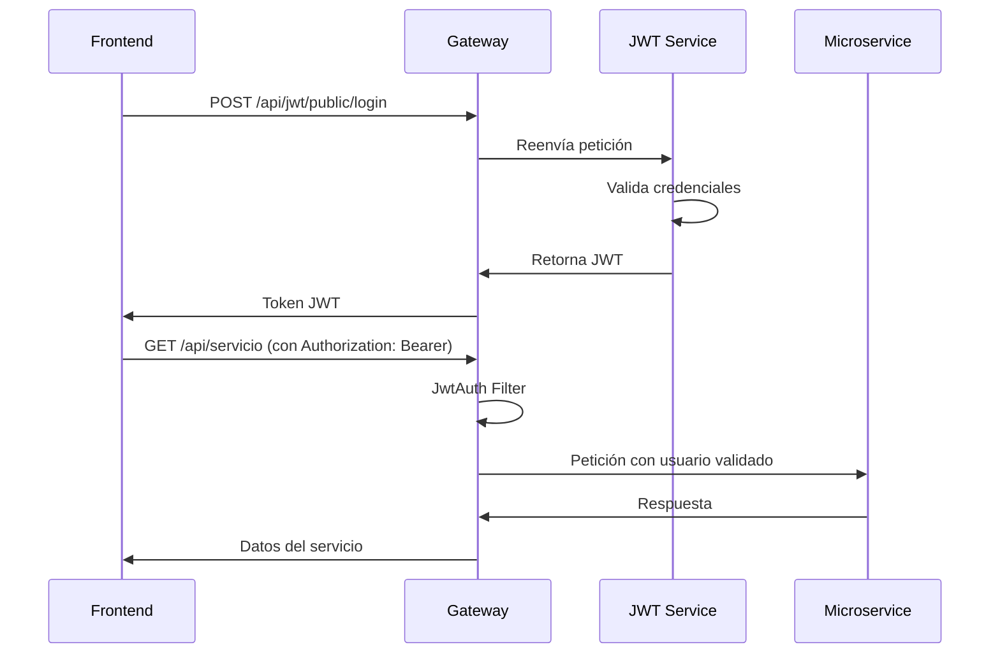

# 🏗️ Arquitectura de Microservicios - Tapalque App

## 📋 Resumen General

La aplicación sigue una arquitectura de microservicios con un API Gateway central que gestiona todas las peticiones, balanceo de carga y autenticación.

## 🌐 Arquitectura General

```
┌─────────────────┐    ┌──────────────────┐    ┌─────────────────┐
│   Frontend     │───▶│   API Gateway    │───▶│  Microservicios │
│  (React Vite)   │    │   (Spring Cloud)  │    │   (Spring Boot) │
└─────────────────┘    └──────────────────┘    └─────────────────┘
                                                       │
                                                       ▼
                                             ┌─────────────────┐
                                             │     Bases de    │
                                             │    Datos (SQL/  │
                                             │    NoSQL)       │
                                             └─────────────────┘
```

## 🐳 Docker Compose - Infraestructura

### 🗄️ **Bases de Datos**
- **MySQL** (8.x): Para datos relacionales
  - `user-db:3309` - Usuarios y roles
  - `comercio-db:3311` - Comercios
  - `servicios-db:3313` - Servicios
  - `gastronomia-db:3305` - Gastronomía
  - `hosteleria-db:3307` - Hospedajes
  - `eventos-db:3312` - Eventos
  - `termas-db:3314` - Termas
  - `espacios-publicos-db:3315` - Espacios Públicos
  - `jwt-db:3309` - Tokens JWT
  - `mercado-pago-db:3308` - Pagos Mercado Pago

- **MongoDB** (Latest): Para datos no estructurados
  - `pedidos-db:27017` - Pedidos
  - `reservas-db:27018` - Reservas

- **RabbitMQ**: Para mensajería asíncrona
  - `rabbitmq:15672` - Panel de gestión
  - `rabbitmq:5672` - Comunicación interna

### 🔧 **Infraestructura**
- **Eureka Server** (`8761`): Service Discovery
- **API Gateway** (`8090`): Entrada principal
- **Frontend** (`3000`): UI para usuarios

## 🚪 API Gateway - Configuración de Rutas

### 🔓 **Rutas Públicas (Sin Autenticación)**
```yaml
- GET /api/servicio          → Lista servicios públicos
- GET /api/comercio/list      → Lista comercios públicos  
- GET /api/hospedajes         → Lista hospedajes públicos
- GET /api/gastronomia/findAll→ Lista gastronomía pública
- GET /api/eventos            → Lista eventos públicos
- GET /api/terma              → Lista termas públicas
- GET /api/espacio-publico    → Lista espacios públicos
- POST /api/jwt/public/login  → Login de usuarios
```

### 🔐 **Rutas Protegidas (Con JWT)**
```yaml
- GET/POST/PUT/DELETE /api/servicio/**      → Gestión servicios
- GET/POST/PUT/DELETE /api/comercio/**      → Gestión comercios
- GET/POST/PUT/DELETE /api/gastronomia/**   → Gestión gastronomía
- GET/POST/PUT/DELETE /api/hospedajes/**    → Gestión hospedajes
- GET/POST/PUT/DELETE /api/eventos/**       → Gestión eventos
- GET/POST/PUT/DELETE /api/terma/**         → Gestión termas
- GET/POST/PUT/DELETE /api/espacio-publico/**→ Gestión espacios
- POST /api/user/moderador/create           → Crear moderador
- GET /api/user/all                         → Listar usuarios
```

### 📁 **Subida de Imágenes**
```yaml
- POST /api/servicio/imagen/{id}     → Subir imágenes servicio
- POST /api/comercio/imagen/{id}     → Subir imágenes comercio
- POST /api/gastronomia/imagen/{id}  → Subir imágenes gastronomía
- POST /api/hospedaje/imagen/{id}    → Subir imágenes hospedaje
- POST /api/eventos/imagen/{id}      → Subir imágenes eventos
- POST /api/terma/imagen/{id}        → Subir imágenes termas
- POST /api/espacio-publico/imagen/{id} → Subir imágenes espacios
```

## 🎯 Microservicios Detallados

### 🔑 **msvc-jwt** - Autenticación
- **Base**: jwt-db
- **Función**: Generar y validar tokens JWT
- **Endpoint público**: `/api/jwt/public/login`

### 👤 **msvc-user** - Gestión de Usuarios
- **Base**: user-db
- **Función**: CRUD de usuarios, roles y permisos
- **Rutas**: Públicas para registro, protegidas para gestión

### 🏪 **msvc-comercio** - Comercios
- **Base**: comercio-db
- **Upload**: comercio_uploads
- **Rutas**: Lista pública, CRUD protegido

### 🔧 **msvc-servicios** - Servicios
- **Base**: servicios-db
- **Upload**: servicios_uploads
- **Rutas**: Lista pública, CRUD protegido

### 🍽️ **msvc-gastronomia** - Gastronomía
- **Base**: gastronomia-db
- **Upload**: gastronomia_uploads
- **Rutas**: Lista pública (`/api/gastronomia/findAll`)

### 🏨 **msvc-hosteleria** - Hospedajes
- **Base**: hosteleria-db
- **Upload**: hosteleria_uploads
- **Rutas**: Lista pública (`/api/hospedajes`)

### 📅 **msvc-eventos** - Eventos
- **Base**: eventos-db
- **Upload**: eventos_uploads
- **Rutas**: Lista pública (`/api/eventos`)

### ♨️ **msvc-termas** - Termas
- **Base**: termas-db
- **Upload**: termas_uploads
- **Rutas**: Lista pública (`/api/terma`)

### 🏞️ **msvc-espacios-publicos** - Espacios
- **Base**: espacios_publicos-db
- **Upload**: espacios_publicos_uploads
- **Rutas**: Lista pública (`/api/espacio-publico`)

### 🛒 **msvc-mercado-pago** - Pagos
- **Base**: mercado_pago-db
- **Función**: Integración con Mercado Pago
- **Rutas**: Todas protegidas

### 📦 **msvc-pedidos** - Pedidos
- **Base**: pedidos-db (MongoDB)
- **Función**: Gestión de pedidos con RabbitMQ
- **Rutas**: Todas protegidas

### 🏥 **msvc-reservas** - Reservas
- **Base**: reservas-db (MongoDB)
- **Función**: Gestión de reservas con RabbitMQ
- **Rutas**: Todas protegidas

## 🔒 Flujo de Autenticación



## 🌍 Variables de Entorno

### 🔧 **Desarrollo** (`.env.development`)
```env
VITE_API_BASE_URL=http://localhost:8090
VITE_APP_TITLE=Tapalque App - Desarrollo
VITE_DEBUG=true
VITE_ENABLE_ANALYTICS=false
```

### 🚀 **Producción** (`.env.production`)
```env
VITE_API_BASE_URL=/api
VITE_APP_TITLE=Tapalque App
VITE_DEBUG=false
VITE_ENABLE_ANALYTICS=true
```

## 📊 Comunicación Entre Microservicios

### 🔄 **Service Discovery (Eureka)**
- Todos los microservicios se registran en Eureka
- Gateway resuelve nombres de servicio a IPs
- Balanceo de carga automático

### 🐇 **Mensajería Asíncrona (RabbitMQ)**
- **Pedidos**: Notificaciones de estado
- **Reservas**: Confirmaciones y cancelaciones
- **Pagos**: Actualización de estados

## 🚀 Despliegue

### 🐳 **Con Docker Compose**
```bash
# Iniciar toda la infraestructura
docker-compose up -d

# Ver logs de un servicio específico
docker-compose logs -f msvc-gateway-server

# Escalar un microservicio
docker-compose up -d --scale msvc-user=3
```

### 📋 **Orden de Inicio**
1. **Bases de datos** (MySQL, MongoDB, RabbitMQ)
2. **Eureka Server** (Service Discovery)
3. **API Gateway** (Balanceador principal)
4. **Microservicios** (se registran en Eureka)
5. **Frontend** (se conecta al Gateway)

## 🔧 Configuración de Red

```yaml
networks:
  tapalque-net:
    driver: bridge
```

- **Puertos Externos**: Solo Frontend (3000) y Gateway (8090)
- **Comunicación Interna**: A través de la red `tapalque-net`
- **Service Discovery**: Eureka gestiona IPs internas

## 📈 Monitoreo y Logging

### 🔍 **Health Checks**
- Gateway: `http://localhost:8090/actuator/health`
- Eureka: `http://localhost:8761/actuator/health`
- Frontend: `http://localhost:3000`

### 📊 **Métricas Disponibles**
- Status de microservicios en Eureka
- Logs de Gateway con detalles de peticiones
- Métricas de bases de datos vía Docker

## 🔄 Flujo Completo de una Petición

1. **Frontend** envía petición a `/api/servicio`
2. **Vite Proxy** la redirige a `http://localhost:8090`
3. **API Gateway** recibe y valida la ruta
4. **Filtro JWT** verifica autenticación (si es necesaria)
5. **Eureka** resuelve `msvc-servicios` a IP interna
6. **Microservicio** procesa la petición
7. **Respuesta** vuelve por el mismo camino

Esta arquitectura garantiza:
- ✅ **Escalabilidad**: Cada servicio puede escalar independientemente
- ✅ **Resiliencia**: Fallas aisladas por servicio
- ✅ **Seguridad**: Autenticación centralizada en el Gateway
- ✅ **Mantenibilidad**: Servicios desacoplados y especializados